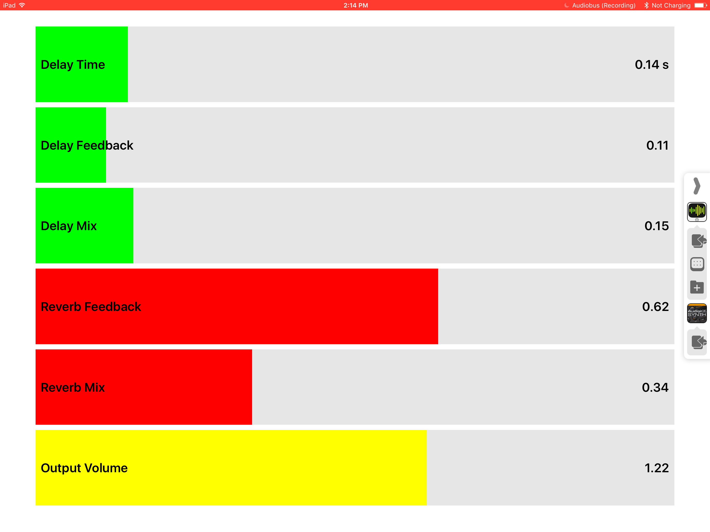

This document will serve to introduce you to developing inter-app audio applications using AudioKit.

AudioKit aims to make developing audio simple, but for the case of inter-app audio, there's only so much we can build into the framework and you'll have a process to follow rather than just a usage API. Hence this tutorial was created to walk you through the process.

Intro
-----

"Audiobus" and "Inter-App" Audio are two different but similar ways of sharing audio between applications on iOS.  Audiobus was developed by the Amazing Michael Tyson and came first.  Later, Apple invented their own way of doing what Audiobus already did and they called it Inter-App Audio.  Because Audiobus came first, and because we know and love Michael Tyson, we give Audiobus top billing. But, there's no reason you can't get both things working in your app simultaneously, and that's what we'll be doing here.

What you'll build
-----------------

There are basically three different things you can do with inter-app audio: you can generate audio to send to other applications, you can receive audio to process and filter and send back out to other apps, or you can receive audio and do something with that audio without sending it back out.

This tutorial, at least initially, will cover only the first two of these use cases.  We'll build a simple synthesizer application to demonstrate generating audio. Then, we'll build a second application to take an audio stream and a nice sounding reverb to it.  By separating these functions into two apps, you have more flexibility, but it is also very possible to have one app that can both generate and filter audio.

Even if you're not interested in generating audio and only filtering audio, it is recommended that you follow the tutorial from start to finish as concepts will only be introduced once.  You'll learn the most by following along and building the applications on your machine, but the finished versions are also included in AudioKit's Examples folder.

Table of Contents
-----------------

* [Sender Synth](sender-synth)
    * Starting the synth project
    * Set Up the Synth (easy!)
    * Set Up the User Interface
    * Installing Audiobus
    * Add the Audiobus Files
    * Project Settings
    * More Project Settings (for Sender apps)
    * Audiobus and Registration
    * Build the app to your device
    * Conclusion (for Sender Apps)

 

* [Filter Effects App](filter-effects)
    * Starting the filter effects project
    * Set up the effects
    * Set up the User Interface
    * Install Audiobus
    * Add the Audiobus Files
    * Project Settings
    * Register your App with Audiobus
    * Conclusion (for Filter Apps)

More Real World Examples
========================

The AudioKit example "Analog Synth X" has been upgraded to support Audiobus and IAA.  It is a full-fledged app that appears on the App Store, but all of the code is available in the AudioKit repository.

In addition, we are finishing up a new synth that will also be open source and demonstrate Audiobus and IAA.

Known Issues
============

* AudioKit audio plots seem to stop working when Audiobus is connected.
* A stereo generator becomes mono when sent through an Audiobus filter.

More Info on Audiobus
=====================

This tutorial stands on its own, but content for it has been shamelessly lifted from other sources, notably the [Audiobus Integration Guide](https://developer.audiob.us/doc/_integration-_guide.html).